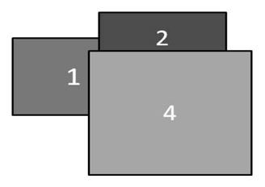
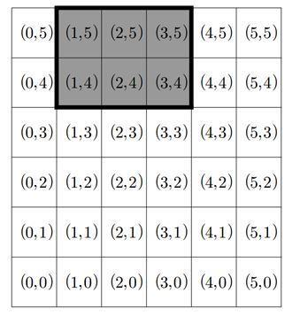

# Color Paper

## 1. 문제
- 평면에 색깔이 서로 다른 직사각형 모양의 색종이 N장이 하나씩 차례로 놓여진다.

- 이 때 색종이가 비스듬하게 놓이는 경우는 없다. 즉, 모든 색종이의 변은 서로 평행하거나, 서로 수직이거나 둘 중 하나이다.

- 그림-1은 1번, 2번, 3번 세 장의 색종이가 순서대로 놓인 상태를 보여준다.

  

- 그림-1

- 여기에 그림-2에서 보인 것처럼 4번 색종이가 하나 더 놓이면 3번 색종이는 완전히 가려서 보이지 않게 된다.

- 그리고, 1번 색종이와 2번 색종이는 부분적으로 가려 보이며, 4번 색종이는 완전히 보이게 된다.

  

- 그림-2

- N장의 색종이가 주어진 위치에 차례로 놓일 경우, 각 색종이가 보이는 부분의 면적을 구하는 프로그램을 작성하시오.  

## 2. 입력
- 첫 번째 줄: 색종이의 장수를 나타내는 정수 N (1 ≤ N ≤ 100)

- 이어서 N장의 색종이에 관한 입력이 각 색종이마다 한 줄씩 차례로 주어진다.

- 색종이가 놓이는 평면은 가로 최대 101칸, 세로 최대 101칸으로 구성된 격자 모양이다.

- 격자의 각 칸은 가로, 세로 길이가 1인 면적이 1인 정사각형이다.

- 편의상 가로 6칸, 세로 6칸으로 이루어진 격자의 예를 들어 설명하면, 각 칸에 표시된 값 (a,b)는 해당 칸의 번호를 나타낸다.

- 가장 왼쪽 아래의 칸은 (0,0) 가장 오른 쪽 위의 칸은 (5,5)이다.

  

- 색종이가 놓인 상태는 가장 왼쪽 아래 칸의 번호와 너비, 높이를 나타내는 네 정수로 표현한다.

- 예를 들어, 위 그림에서 회색으로 표시된 색종이는 (1,4)가 가장 왼쪽 아래에 있고 너비 3, 높이 2이므로 1 4 3 2로 표현한다.

- 색종이가 격자 경계 밖으로 나가는 경우는 없다.

## 3. 출력
- 입력에서 주어진 순서에 따라 N장의 색종이를 평면에 놓았을 때, 입력에서 주어진 순서대로 각 색종이가 보이는 부분의 면적을 한 줄에 하나씩 하나의 정수로 출력한다.
- 만약 색종이가 보이지 않는다면 정수 0을 출력한다.

## 4. 예제 입력
```
2
0 0 10 10
2 2 6 6
```

## 5. 예제 출력
```
64
36
```

## 6. 코드
```c++
#include <stdio.h>

int main() {
  int i, j, k, x, y, width, height, cnt = 0;
  int paperIndex;
  int paperArr[101][101];
  
  for (i = 0; i < 101; i++) {
    for (j = 0; j < 101; j++) {
      paperArr[i][j] = 0;
    }
  }
  
  scanf("%d", &paperIndex);
  int colorPaperArr[paperIndex];
  for (i = 0; i < paperIndex; i ++) {
    colorPaperArr[i] = 0;
  }
  
  for(i = 0; i < paperIndex; i++) {
    scanf("%d %d %d %d", &x, &y, &width, &height);
    for (j = x; j < x + width; j++) {
      for (k = y; k < y + height; k++) {
        paperArr[j][k] = i + 1;
      }
    }
  }
  
  for (i = 0; i < 101; i++) {
    for (j = 0; j < 101; j++) {
      if (paperArr[i][j] != 0) {
        int index = paperArr[i][j] - 1;
        colorPaperArr[index] += 1;
      }
    }
  }
  
  for (i = 0; i < paperIndex; i ++) {
    printf("%d\n", colorPaperArr[i]);
  }

  return 0;
}
```
