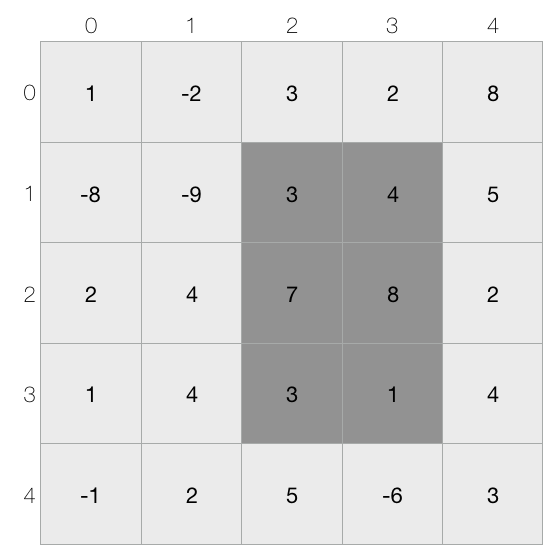

# 직사각형의 합

## 1. 문제

- N x M 의 직사각형이 주어지며, 각 칸에는 정수가 들어있다.
- 이제 Q개의 질문에 대하여 답을 해야 하며, 각각의 질문은 (a, b)부터 (c, d)까지의 직사각형에 들어있는 정수의 합을 묻는다.
- 예를 들어, 다음과 같이 5 x 5 의 직사각형이 주어질 때, (1, 2) 부터 (3, 3) 까지의 직사각형에 들어있는 정수의 합은 26 이다.



## 2. 입력
- 첫 번째 줄에 N, M, Q가 주어진다.
- ( 1 ≤ N, M ≤ 1,000, 1 ≤ Q ≤ 1,000,000 )
- 두 번째 줄부터 N x M 직사각형이 주어진다.
- 직사각형 안의 숫자 S는 -100이상 100이하이다.
- 그 후 Q개의 질문이 주어진다.
- 각각의 질문은 “a b c d” 로 이루어 져 있으며, 이는 (a, b) 부터 (c, d) 까지의 직사각형에 들어있는 정수의 합을 묻는다.
- (0 ≤ a ≤ c < N, 0 ≤ b ≤ d < M) 

## 3. 출력

- 각 질문에 대한 답을 출력한다.


## 4. 예제 입력
```
5 5 3
 1 -2 3 2 8
-8 -9 3 4 5
 2 4 7 8 2
 1 4 3 1 4
-1 2 5 -6 3
1 2 3 4
0 0 1 1
2 0 2 1
```

## 5. 예제 출력
```
37
-18
6
```

## 6. 코드

```c++
#include <stdio.h>

const int MAX = 1001;
int n, m, q, s1, s2, e1, e2;
int arr[MAX][MAX];
int plus[MAX][MAX];

int main() {
  
  scanf("%d %d %d", &n, &m, &q);

  for(int i = 0; i < n; i++) {
    for(int j = 0; j < m; j++) {
      scanf("%d", &arr[i][j]);
    }
  }
  
  for(int i = 0; i < n; i++) {
    for(int j = 0; j < m; j++) {
      if(i == 0 && j == 0) {
        plus[0][0] = arr[0][0];
      } else if (i == 0) {
        plus[i][j] = plus[i][j-1] + arr[i][j];
      } else if (j == 0) {
        plus[i][j] = plus[i-1][j] + arr[i][j];
      } else {
        plus[i][j] = plus[i][j-1] + plus[i-1][j] - plus[i-1][j-1] + arr[i][j];
      }
    }
  }
  
  for(int i = 0; i < q; i++) {
    int result = 0;
    scanf("%d %d %d %d", &s1, &s2, &e1, &e2);
    if (s1 == 0 && s2 == 0) {
      result = plus[e1][e2];
    } else if (s1 == 0) {
      result = plus[e1][e2] - plus[e1][s2-1];
    } else if (s2 == 0) {
      result = plus[e1][e2] - plus[s1-1][e2];
    } else {
      int x = plus[s1-1][s2-1];
      result = plus[e1][e2] - plus[e1][s2-1] - plus[s1-1][e2] + x;
    }
    printf("%d\n", result);
  }

  return 0;
}
```
