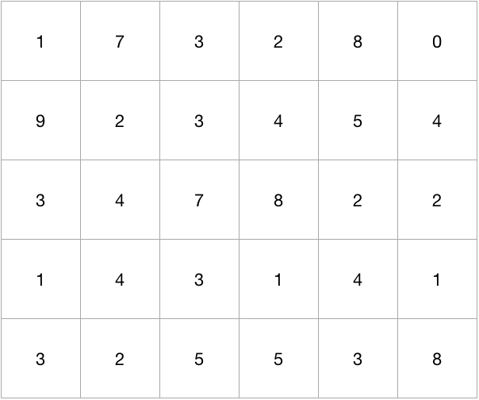
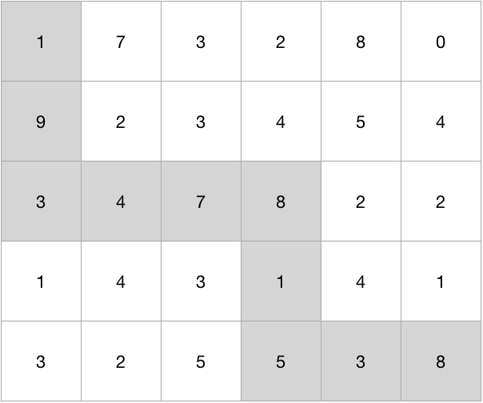

# 자원 채취

## 1. 문제
- N x M의 지도가 주어지며, 이 지도의 각 칸에는 자원이 존재한다.
- 자원의 양은 정수로 나타난다.
- 다음 그림은 5 x 6 의 지도에 존재하는 자원을 나타낸다.



- 철수는 자원을 채취하는 로봇을 갖고 있으며, 이 로봇은 (0, 0) 에서 출발하여 (N-1, M-1) 에서 자원 채취를 마친다.
- 로봇은 한가지 제약이 있는데, 오른쪽과 아랫쪽으로밖에 움직일 수 없다는 것이다.
- 이 로봇을 이용하여 가장 많이 채취할 수 있는 자원의 양을 출력하는 프로그램을 작성하시오.
- 위의 예제의 경우 다음과 같이 채취하는 것이 최대이며, 그 양은 49이다.



## 2. 입력
- 첫 번째 줄에 N, M이 주어진다.
- ( 1 ≤ N, M ≤ 1,000 )
- 두 번째 줄부터 N x M 의 지도에 존재하는 자원의 양이 주어진다.

## 3. 출력

- 로봇을 이용하여 채취할 수 있는 자원의 양의 최댓값을 출력한다.

## 4. 예제 입력
```
5 6
1 7 3 2 8 0
9 2 3 4 5 4
3 4 7 8 2 2
1 4 3 1 4 1
3 2 5 5 3 8
```

## 5. 예제 출력
```
49
```

## 6. 코드

```c++
#include <stdio.h>
#include <algorithm>
#include <vector>
using namespace std;

const int MAX = 10000;
int n, m;
int arr[MAX][MAX];

int main() {
  scanf("%d %d", &n, &m);
  int t[n][m];
  
  for(int i = 0; i < n; i++) {
    for(int j = 0; j < m; j++) {
      scanf("%d", &arr[i][j]);
    }
  }
  
  for(int i = 0; i < n; i++) {
    for(int j = 0; j < m; j++) {
      if(i == 0 && j == 0) { t[i][j] = arr[0][0]; }
      else if(i == 0) { t[i][j] = t[i][j-1] + arr[i][j]; }
      else if(j == 0) { t[i][j] = t[i-1][j] + arr[i][j]; }
      else {
        t[i][j] = max(t[i-1][j], t[i][j-1]) + arr[i][j];
      }
    }
  }
  
  printf("%d ", t[n-1][m-1]);
  return 0;
}
```
