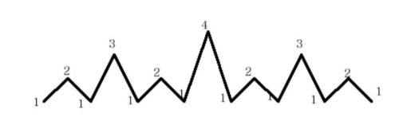

# Mountain

## 1. 문제

- 봉우리가 여러개인 산 모양을 출력한다.
- 산 모양은 그림과 같고 좌우 대칭이다.



## 2. 입력
- 첫 번째 줄에 숫자를 입력 받는다.
- 숫자의 크기는 20보다 작은 자연수이다.

## 3. 출력

- 출력 예의 형식으로 출력한다.


## 4. 예제 입력
```
3
```

## 5. 예제 출력
```
1213121
```

## 6. 예제 입력

```
5
```

## 7. 예제 출력

```
1213121412131215121312141213121
```

## 8. 코드

```c++
#include <stdio.h>
int getMountain(int n) {
  if(n == 1) printf("1");
  else {
    getMountain(n-1);
    printf("%d", n);
    getMountain(n-1);
  }
}

int main() {
  int num;
  scanf("%d", &num);
  getMountain(num);
  return 0;
}
```
