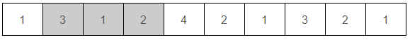

# Non-Duplicated Section #

## 1. 문제
- n개의 숫자가 주어지고, 이 중에서 r개의 연속된 숫자를 선택했을 때, 이 연속 부분 내에는 숫자가 중복되지 않기를 원한다.

- 예를 들어, 다음과 같이 10개의 숫자에서 3개의 연속된 숫자를 선택할 수 있다.

  

- 이렇게 선택을 하면, 선택된 숫자들 사이에서는 중복이 존재하지 않는다.

- r의 최댓값을 구하는 프로그램을 작성하시오.

- 위의 경우, (4, 2, 1, 3)을 선택하면 되므로 r의 최댓값은 4이다.

- r이 5 이상이 될 경우, 중복 없이 연속 부분을 선택하는 것이 불가능하다.

## 2. 입력
- 첫째 줄: 숫자의 개수 n이 주어진다. ( 1 ≤ n ≤ 100,000 )
- 둘째 줄: n개의 숫자가 주어진다. 각 숫자는 항상 1보다 크거나 같고, n보다 작거나 같다.  

## 3. 출력
- r의 최댓값을 출력한다.

## 4. 예제 입력
```
10
1 3 1 2 4 2 1 3 2 1
```

## 5. 예제 출력
```
4
```

## 6. 예제 입력

```
7
7 1 4 2 5 3 6
```

## 7. 예제 출력

```
7
```

## 8. 코드

```c++
#include <stdio.h>
int n, arr[100000];

bool check(int interval) {
  int checkArr[n+1], cnt = 0;
  for(int i = 0; i < n+1; i++) {
    checkArr[i] = 0;
  }
  
  for(int i = 0; i < interval; i++) {
    checkArr[arr[i]] += 1;
  }
  
  for(int i = 1; i < n+1; i++) {
    if(checkArr[i] > 1) cnt++;
  }
  
  if(cnt == 0) return true;
  
  for(int i = interval; i < n; i++) {
    checkArr[arr[i-interval]] -= 1;
    if(checkArr[arr[i-interval]] == 1) cnt--;
    
    checkArr[arr[i]] += 1;
    if(checkArr[arr[i]] > 1) cnt++;
    if(cnt == 0) return true;
  }
  return false;
}

int binarySearch(int start, int end) {
  if(start > end) return end;
  else {
    int mid = (start + end) / 2;
    
    if(check(mid)) return binarySearch(mid+1,end);
    else return binarySearch(start,mid-1);
  }
}

int main() {
  scanf("%d", &n);
  
  for(int i = 0; i < n; i++) scanf("%d", &arr[i]);
  int k = binarySearch(1,n);
  
  printf("%d", k);
  return 0;
}
```
