# Quick Sort

## 1. 개념
- 삽입 정렬은 아직 정렬되지 않은 임의의 데이터를 이미 정렬된 부분의 적절한 위치에 삽입해 가며 정렬하는 방식이다.
- 그러면 아래의 삽입 정렬의 동작 과정을 이용해 살펴보자.

## 2. 동작 방식

- 퀵 정렬의 동작 과정은 다음 예를 통해 살펴보자.

  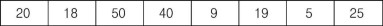

- 맨 앞의 20을 기준키로 하고, 기준키 다음부터 기준키보다 큰 데이터를 찾아 50을 선택하고, 마지막 데이터부터 기준키보다 작은 데이터를 찾아 5를 선택한다. 그리고 선택된 50과 5를 교환한다.

  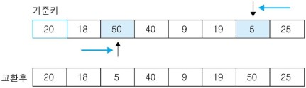

- 계속해서 진행하여 기준키보다 큰 데이터인 40을 선택하고, 기준키보다 작은 데이터인 19를 선택한다. 그리고 두 수를 교환한다.

  

- 마찬가지로 진행하여 기준키보다 큰 데이터인 40과 기준키보다 작은 데이터인 9를 선택한다. 그런데 발견된 위치가 서로 교차하는데, 이런 경우에는 두 값을 교환하지 않고 기준키 20과 작은 데이터인 9를 교환한다. 또한 기준키보다 큰 데이터를 발견하지 못하는 경우에도 기준키와 작은 데이터를 교환한다.

  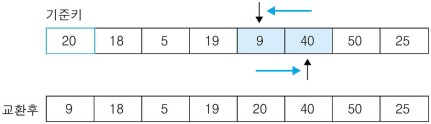

- 데이터들을 보면 기준키 20을 기준으로 왼쪽에는 기준키보다 작은 데이터들이, 오른쪽에는 큰 데이터들이 있음을 알 수 있다. 이때 기준키를 중심으로 양분한다.

  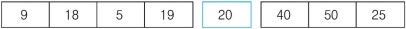
  
  이제부터는 기준키를 중심으로 왼쪽 데이터들에 대해 그리고 오른쪽 데이터들에 대해 같은 방법으로 동작한다. 먼저 왼쪽 데이터들에 대해 동작하는 과정을 살펴보자.

- 기준키 9보다 큰 데이터인 18과 작은 데이터인 5를 선택하고 교환한다.

  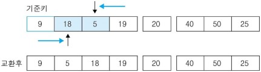

- 마찬가지로 진행하여 큰 데이터인 18과 작은 데이터인 5를 선택하는데, 발견된 위치가 교차되므로 기준키 9와 작은 데이터인 5를 교환한다.
  
  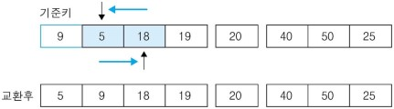
  
- 그리고 기준키 9를 중심으로 양분한다.

  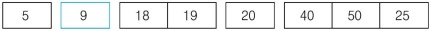
  
- {18, 19}에 대해 기준키 18보다 큰 데이터인 19와 기준키와 작거나 같은(같은 것도 포함됨) 데이터인 18을 선택하는데, 발견된 위치가 교차되므로 기준키 18과 기준키보다 작거나 같은 18을 교환한다.

  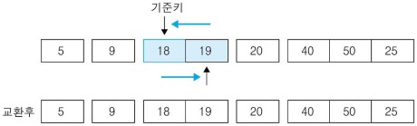
  
- 그리고 양분한다.

  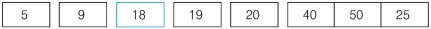
  
- 이제 {40, 50, 25}에 대해 동작하게 되어 기준키 40보다 큰 50과 작은 25를 선택한다. 그리고 이 두 수를 교환한다.

  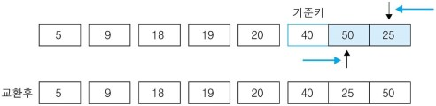

- 다음으로 큰 데이터인 50과 작은 데이터인 25를 선택하는데, 교차하므로 기준키 40과 작은 데이터인 25를 교환한다.

  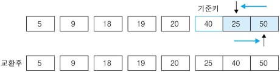

- 그리고 기준키 40을 기준으로 양분한다. 모든 동작이 완료된다.

  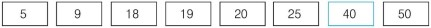

## 3. 코드
```c++
#include <stdio.h>

int getLeft(int arr[], int s, int e, int pivot, int result[]) {
  //리턴할 left 배열의 인덱스 카운트 생성
  int count = 0;
  
  // pivot보다 작거나 같은면 left 배열에 저장
  for(int i = s; i <= e; i++) {
    if(arr[i] <= pivot) result[count++] = arr[i];
  }
  
  // 모든 비교가 끝난 후에 최종 인덱스 카운트를 리턴
  return count;
}

int getRight(int arr[], int s, int e, int pivot, int result[]) {
  // 리턴할 right 배열의 인덱스 카운터 생성
  int cnt = 0;

  // pivot보다 크면 right 배열에 저장  
  for(int i = s; i <= e; i++) {
    if(arr[i] > pivot) result[cnt++] = arr[i];
  }
  
  // 모든 비교가 끝난 후에 최종 인덱스 카운트를 리턴
  return cnt;
}

// 퀵 정렬 (정렬할 배열, 시작 인덱스, 종료 인덱스)
void quickSort(int arr[], int start, int end) {
  // 인자가 한개일 때는 리턴
  if(start >= end) return;
  // 아닐 때는 피봇을 설정하여 피봇 보다 적은 값인 left 배열과 피봇보다 큰 값인 right 배열을 만들어서
  // getLeft, getRight 함수를 이용하여 각각의 배열에 저장시키고 저장 시키고 다시 그 배열을 퀵소트 시킨다.
  else {
    int pivot = arr[start]; // 피봇 설정 (일단은 시작 인덱스로 피봇 설정)
    int left[100000], right[100000]; // 피봇 보다 적고 큰 값을 저장할 배열을 생성
    
    // left 배열의 인덱스 카운트를 저장시킬 프로퍼티를 만들고 getLeft를 호출
    // getLeft(피봇과 비교할 배열, 시작 인덱스(피봇이 첫번째 임으로 피봇을 제외한 나머지), 끝 인덱스, 저장할 left 배열)
    int leftIndexCnt = getLeft(arr, start+1, end, pivot, left);
    // right 배열의 인덱스 카운트를 저장시킬 프로퍼티를 만들고 getRight를 호출
    // getRight(피봇과 비교할 배열, 시작 인덱스(피봇이 첫번째 임으로 피봇을 제외한 나머지), 끝 인덱스, 저장할 left 배열)
    int rightIndexCnt = getRight(arr, start+1, end, pivot, right);
    
    // 가져온 left, right 배열을 이용하여 arr를 다시 만들어 준다. (arr = left - pivot - right 형식으로)
    for(int i = 0; i < leftIndexCnt; i++) arr[start+i] = left[i];
    arr[start+leftIndexCnt] = pivot;
    for(int i = 0; i < rightIndexCnt; i++) arr[start+leftIndexCnt+i+1] = right[i];
    
    // 또 다시 왼쪽 배열과 오른쪽 배열을 퀵 소트해서 인자값이 한개가 되기전까지 정렬 시킨다.
    quickSort(arr,start,start+leftIndexCnt-1);
    quickSort(arr,start+leftIndexCnt+1,end);
  }
}

int main() {
  int n;
  int numArr[100000];
  
  // 배열의 크기
  scanf("%d", &n);
  
  // 배열의 인자 값 설정
  for(int i = 0; i < n; i++) scanf("%d", &numArr[i]);
  
  // 퀵 정렬 (정렬할 배열, 시작 인덱스, 종료 인덱스)
  quickSort(numArr,0,n-1);
  
  // 정렬된 배열 출력
  for(int i = 0; i < n; i++) printf("%d ", numArr[i]);

  return 0;
}
```

## 4. 시간복잡도

- Θ (n log n)
- 퀵정렬은 안정정렬에 속하지는 않고 최악의 경우 Θ (n 제곱)의 시간복잡도를 가진다.

## 5. 출처

- [네이버 지식백과](https://terms.naver.com/entry.nhn?docId=2270444&cid=51173&categoryId=51173)
