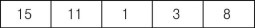
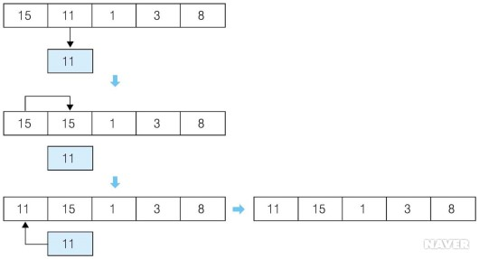
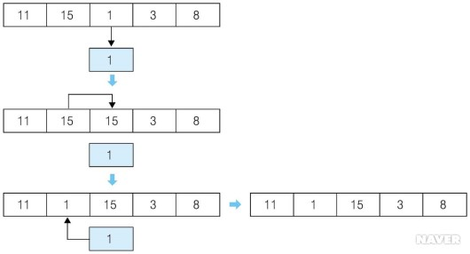
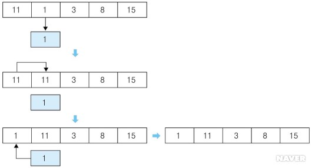
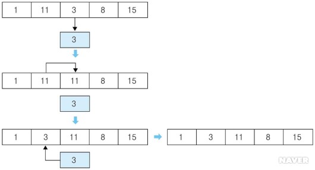
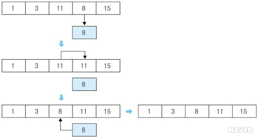
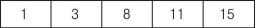

# Bubble Sort

## 1. 개념
- 버블 정렬은 서로 이웃한 데이터들을 비교하며 가장 큰 데이터를 가장 뒤로 보내며 정렬하는 방식이다.
- 아래의 버블 정렬의 동작 과정을 이용해서 살펴보자.

## 2. 동작 방식

- 빈 배열

  

- 첫 번째 데이터인 15와 두 번째 데이터인 11을 비교해 큰 데이터를 뒤로 위치시킨다. 15가 크므로 둘의 위치를 바꾼다.

  

- 두 번째 데이터인 15와 세 번째 데이터인 1을 비교하는데, 앞에 위치한 15가 크므로 둘의 위치를 바꾼다.

  

- 마찬가지 방식을 적용해 세 번째 데이터인 15와 네 번째 데이터인 3의 위치를 바꾼다.

  

- 마찬가지 방식을 적용해 네 번째 데이터인 15와 마지막 데이터인 8의 위치를 바꾼다. 가장 큰 데이터인 15가 가장 뒤에 위치하게 된다.

  

- 처음부터 다시 시작한다. 첫 번째 데이터인 11과 두 번째 데이터인 1의 크기를 비교하는데 앞에 위치한 11이 크므로 둘의 위치를 바꾼다.

  

- 마찬가지 방식을 적용해 두 번째 데이터인 11과 세 번째 데이터인 3의 위치를 바꾼다.

  

- 마찬가지 방식을 적용해 세 번째 데이터인 11과 네 번째 데이터인 8의 위치를 바꾼다. 두 번째로 큰 데이터인 11이 뒤에서 두 번째에 위치하게 된다.

  

- 처음부터 다시 시작한다. 첫 번째 데이터인 1과 두 번째 데이터인 3의 크기를 비교하는데 앞에 위치한 1이 작으므로 그대로 둔다.

  

- 두 번째 데이터인 3과 세 번째 데이터인 8의 크기를 비교하는데, 앞에 위치한 3이 작으므로 그대로 둔다. 세 번째로 큰 데이터인 8이 뒤에서 세 번째에 위치하게 된다.

- 처음부터 다시 시작한다. 첫 번째 데이터인 1과 두 번째 데이터인 3의 크기를 비교하는데, 앞에 위치한 1이 작으므로 그대로 둔다. 데이터들에 대한 정렬이 완료된다.

## 3. 코드

```c++
#include <stdio.h>
const int MAX = 10000;

int main() {
  int data[MAX], size;
  
  // 정렬 전 배열 입력
  scanf("%d", &size);
  for(int i = 0; i < size; i++) {
    scanf("%d", &data[i]);
  }
  
  // 정렬
  for(int i = 0; i < size; i++) {
    for(int j = 0; j < size - i - 1; j++) {
      if(data[j] > data[j + 1]) {
        int temp;
        temp = data[j];
        data[j] = data[j + 1];
        data[j + 1] = temp;
      }
    }
  }
  
  // 정렬 결과
  for(int i = 0; i < size; i++) {
    printf("%d ", data[i]);
  }
  
  return 0;
}
```

## 4. 시간복잡도

- Θ (n 제곱)

## 5. 출처

- [네이버 지식백과](https://terms.naver.com/entry.nhn?docId=2270437&cid=51173&categoryId=51173)