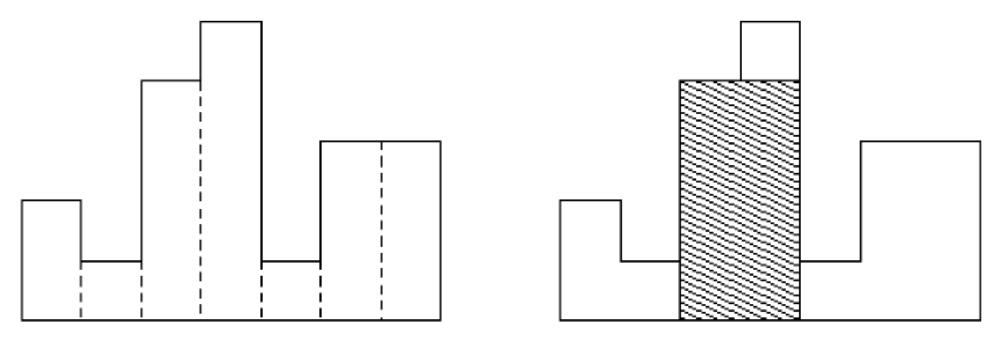

# Largest Rectangle in The Histogram #

## 1. 문제
- 히스토그램이란, 아래 그림과 같이 직사각형이 배열되어 있는 것을 말한다. 

- 각 직사각형의 가로 길이는 1로 모두 같고, 세로 길이는 다를 수 있다. 

- 예를 들어, 아래 그림은 높이가 2, 1, 4, 5, 1, 3, 3 인 직사각형으로 이루어진 히스토그램이다.

  

- 히스토그램이 주어질 때, 가장 큰 직사각형의 너비를 출력하는 프로그램을 작성하시오.

- 위의 예제에서는 최대 직사각형의 너비가 그림과 같이 8이다.

## 2. 입력
- 첫째 줄: 히스토그램을 이루는 직사각형의 개수 N이 주어진다. ( 1 ≤ N ≤ 100,000 )
- 둘째 줄: 각 직사각형의 높이가 주어진다. (0 <= 높이 <= 10,000)

## 3. 출력
- 최대 직사각형의 너비를 출력한다.

## 4. 예제 입력
```
7
2 1 4 5 1 3 3
```

## 5. 예제 출력
```
8
```

## 6. 코드

```c++
#include <stdio.h>

const int MAX = 100000;

struct Stack {
  int data[MAX];
  int capacity;
  int top;
  
  void create(int size) {
    capacity = size;
    top = -1;
  }
  
  void push(int x) {
    if(top >= capacity) return;
    else {
      data[++top] = x;
    }
  }
  
  void pop() {
    top--;
  }
  
  int peek() {
    return data[top];
  }
  
  int size() {
    return top + 1;
  }
};


int main() {
  Stack s1;
  int arr[MAX], size;
  int max = -1, min = 10001;
  
  scanf("%d", &size);
  s1.create(size);
  
  for(int i = 0; i <= size; i++) {
    int n;
    scanf("%d", &n);
    arr[i] = n;
    if(min > n && i < size) min = n;
    if(size == i) arr[i] = -1;
  }
  
  for(int i = 0; i <= size; i++) {
    if(s1.top == -1) {
      s1.push(i);
    } else if(arr[s1.peek()] < arr[i]) {
      s1.push(i);
    } else {
      while(arr[s1.peek()] > arr[i] && s1.top > -1) {
        int index = s1.peek();
        s1.pop();
        int number;
        
        if (s1.size() == 0) {
          number = arr[index] * (index + 1);
        } else {
          number = arr[index] * (i - s1.peek() - 1);
        }
        if(max < number) {
          max = number;
        }
      }
      s1.push(i);
    }
  }
  
  if(min * size <= max) {
    printf("%d", max);
  } else {
    printf("%d", min * size);
  }
  
  return 0;
}
```
